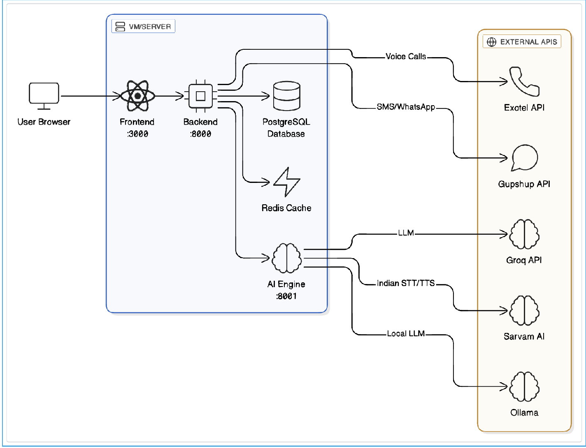
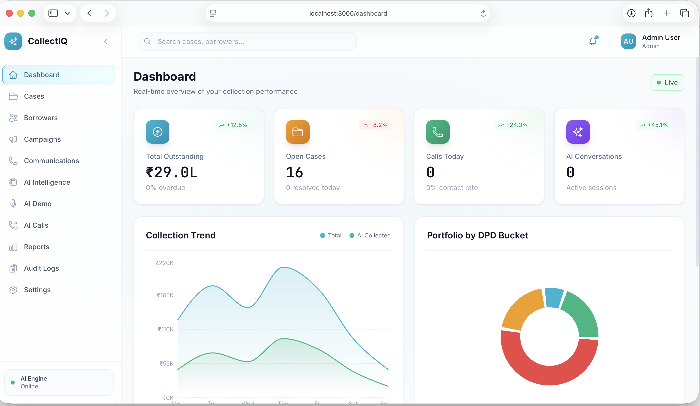
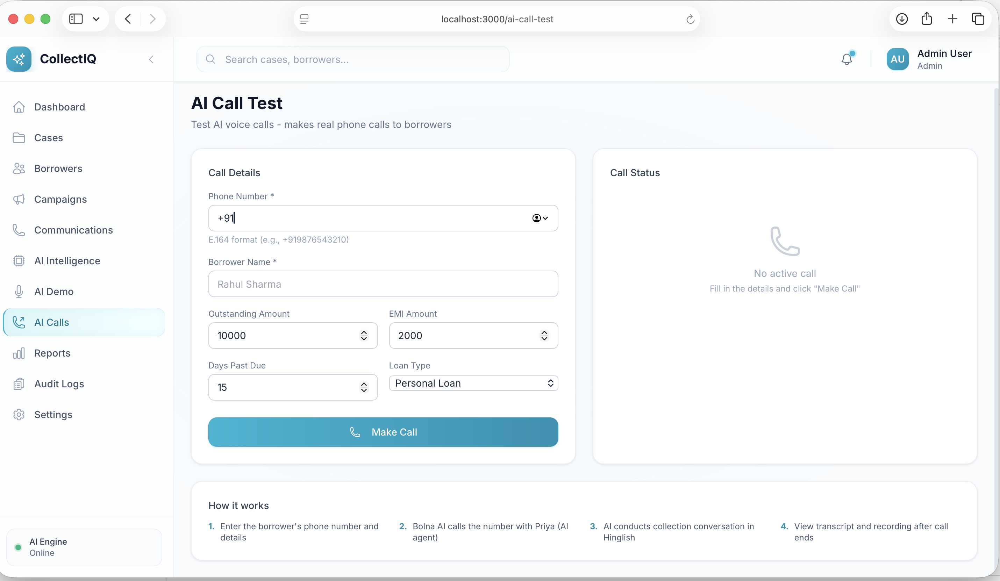
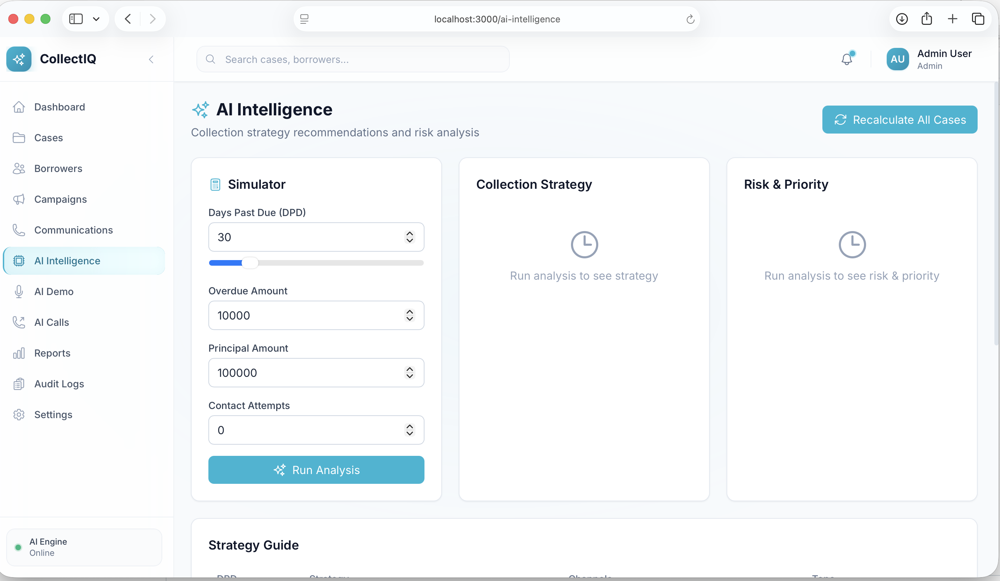
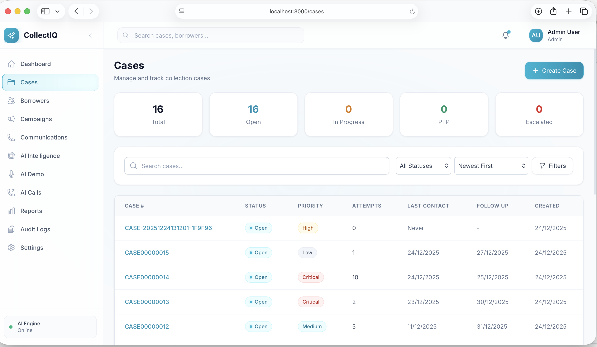
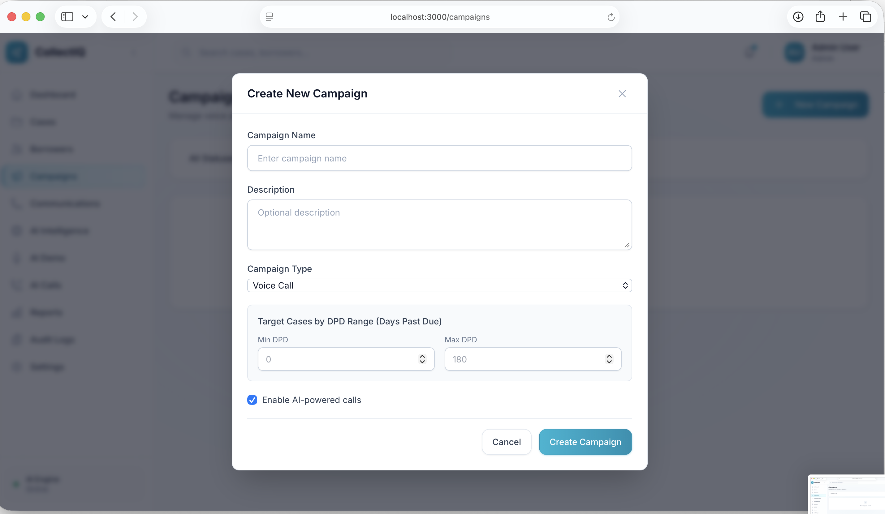
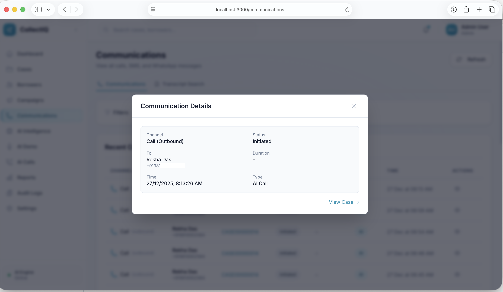
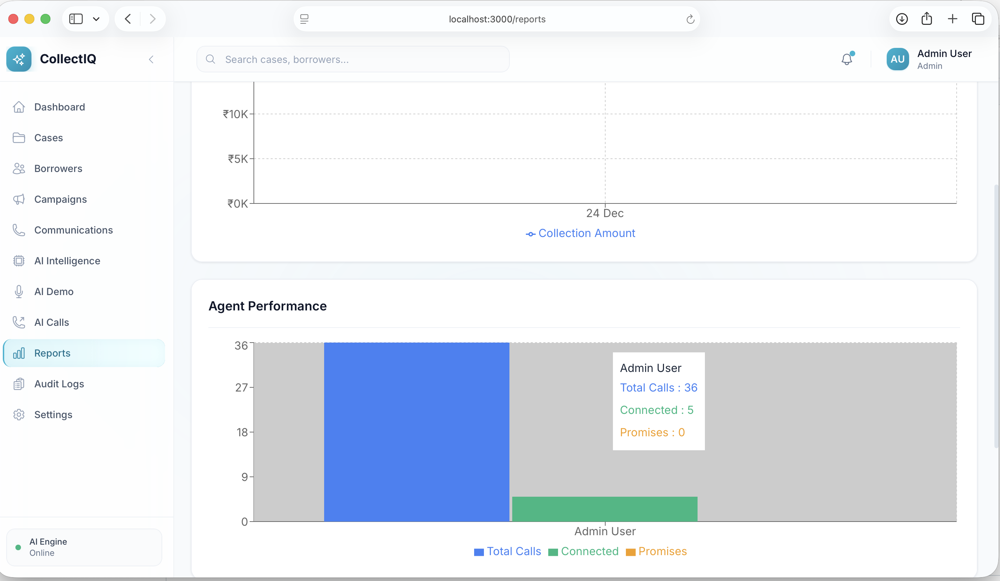
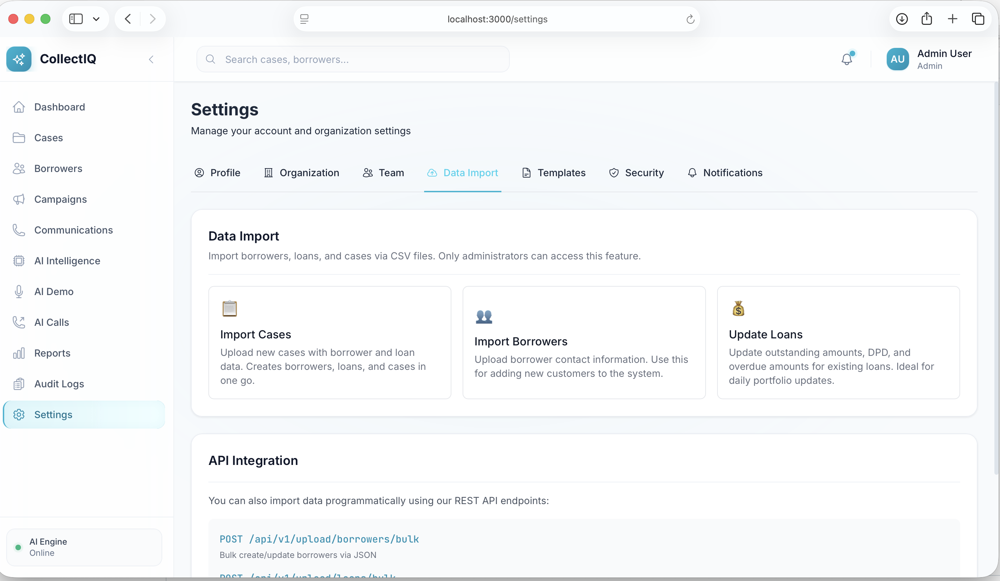

# CollectIQ - AI-Powered Loan Collection Platform

An intelligent loan collection platform for Indian financial institutions, featuring AI voice bots, multi-channel communication, and comprehensive analytics.

## Architecture



## Screenshots

### Dashboard


### AI Voice Calls


### AI Intelligence


<details>
<summary>More Screenshots</summary>

### Case Management


### Campaign Management


### Communications & Transcripts


### Reports & Analytics


### Settings & Data Import


</details>

## Features

- **AI Voice Calling** - Automated collection calls via [Bolna AI](docs/voice-ai-providers.md#bolna-ai-setup), [Sarvam AI](docs/voice-ai-providers.md#sarvam-ai-setup), or [LiveKit](docs/voice-ai-providers.md#livekit-setup)
- **Real-Time Voice Demo** - Browser-based [voice testing](docs/voice-demo.md) with configurable TTS (Edge/Sarvam)
- **Multi-Language Support** - Hindi, English, and 9 Indian regional languages
- **Multi-Channel Communication** - Phone calls, SMS, WhatsApp
- **Campaign Automation** - Bulk calling with retry scheduling, per-campaign provider selection, and live monitoring
- **AI Intelligence** - Priority scoring, risk assessment, and collection strategy recommendations
- **Case Management** - Assign, track, and manage collection cases
- **Analytics Dashboard** - Real-time metrics and agent performance
- **Compliance Built-in** - RBI guideline compliance checking

## Tech Stack

| Component | Technology |
|-----------|------------|
| Backend + Telephony | Python 3.11+, FastAPI, PostgreSQL, Redis, Celery |
| Frontend | React 18, TypeScript, Tailwind CSS, Zustand |
| AI Engine | Whisper/Groq/Sarvam STT, Edge/Sarvam TTS, Ollama/Groq/Sarvam LLM |
| Voice AI | Bolna AI, ElevenLabs |
| Telephony | Exotel (production), Gupshup (SMS/WhatsApp), Mock (development) |

## Quick Start

### Prerequisites

- Python 3.11+
- Node.js 18+
- PostgreSQL 15+
- Redis

### Installation

```bash
# Clone and install
git clone <repository-url>
cd collectiq
./scripts/install.sh

# Setup database
./scripts/setup_db.sh
./scripts/seed.sh  # Optional: sample data

# Setup AI (optional, for local LLM)
./scripts/ollama_setup.sh

# Start all services
./scripts/start.sh
```

### Access

| Service | URL |
|---------|-----|
| Frontend | http://localhost:3000 |
| Backend API (includes Telephony) | http://localhost:8000/docs |
| AI Engine | http://localhost:8001/docs |

### Default Login

- Email: `admin@collectiq.com`
- Password: `password123`

## Documentation

| Document | Description |
|----------|-------------|
| [User Guide](docs/user-guide.md) | Quick start for end users |
| [Voice AI Providers](docs/voice-ai-providers.md) | Setup Bolna AI or ElevenLabs for automated calls |
| [Exotel Integration](docs/exotel.md) | Direct Exotel telephony for production calls |
| [Sarvam AI](docs/sarvam-ai.md) | Indian language AI (STT, TTS, LLM) |
| [Voice Demo](docs/voice-demo.md) | Browser-based voice testing guide |
| [Development](docs/development.md) | Running services, testing, project structure |
| [Configuration](docs/configuration.md) | Environment variables reference |

## Quick Configuration

```bash
# .env - Minimal setup for AI calling

# Database
POSTGRES_HOST=localhost
POSTGRES_DB=loan_collection

# AI Providers
LLM_PROVIDER=groq          # ollama, groq, or sarvam
STT_PROVIDER=groq          # whisper, groq, or sarvam
TTS_PROVIDER=edge          # edge or sarvam
GROQ_API_KEY=gsk_your_api_key

# Voice AI (for automated calls)
VOICE_AI_PROVIDER=bolna    # bolna, elevenlabs, or exotel
BOLNA_API_KEY=bn-your-api-key
BOLNA_AGENT_ID=your-agent-id

# Telephony (for direct calls)
TELEPHONY_PROVIDER=mock    # mock or exotel
EXOTEL_API_KEY=your-key
EXOTEL_SID=your-sid
EXOTEL_CALLER_ID=+91XXXXXXXXXX
```

See [Configuration Guide](docs/configuration.md) for all options.

## Scripts

| Script | Description |
|--------|-------------|
| `./scripts/start.sh` | Start all services |
| `./scripts/stop.sh` | Stop all services |
| `./scripts/migrate.sh upgrade` | Run database migrations |
| `./scripts/seed.sh` | Seed sample data |
| `./scripts/logs.sh all` | View all logs |

See [Development Guide](docs/development.md) for more scripts.

## Compliance

Built-in RBI collection guideline compliance:
- Timing restrictions (8 AM - 7 PM)
- Language monitoring
- Privacy protection
- Call recording for audit

## License

Apache License 2.0 - see [LICENSE](LICENSE)
