# CollectIQ User Guide

Quick guide to get started with the loan collection platform.

## Login

1. Go to `http://your-domain:3000`
2. Login with your credentials
3. Default admin: `admin@collectiq.com` / `password123`

## Dashboard

After login, you'll see the main dashboard with key metrics:

- **Total Cases** - Active collection cases
- **Amount Due** - Total outstanding across all cases
- **Today's Follow-ups** - Cases needing attention today
- **Recent Activity** - Latest communications and updates

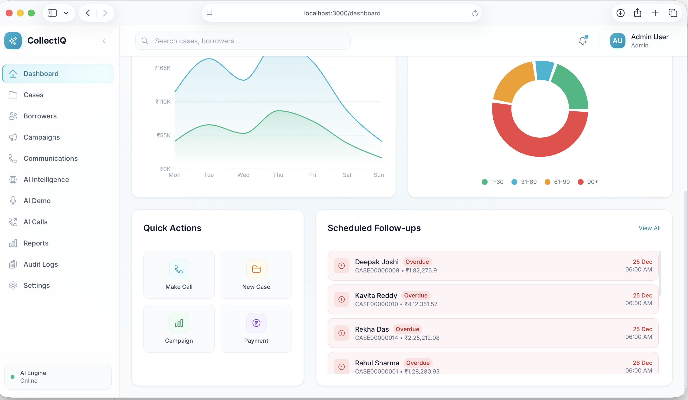

## Managing Cases

### View Cases

Click **Cases** in sidebar to see all collection cases:

- Use search to find by name, phone, or case number
- Filter by status: Open, In Progress, Promise to Pay, Resolved

### Case Filters

Use advanced filters to narrow down cases:

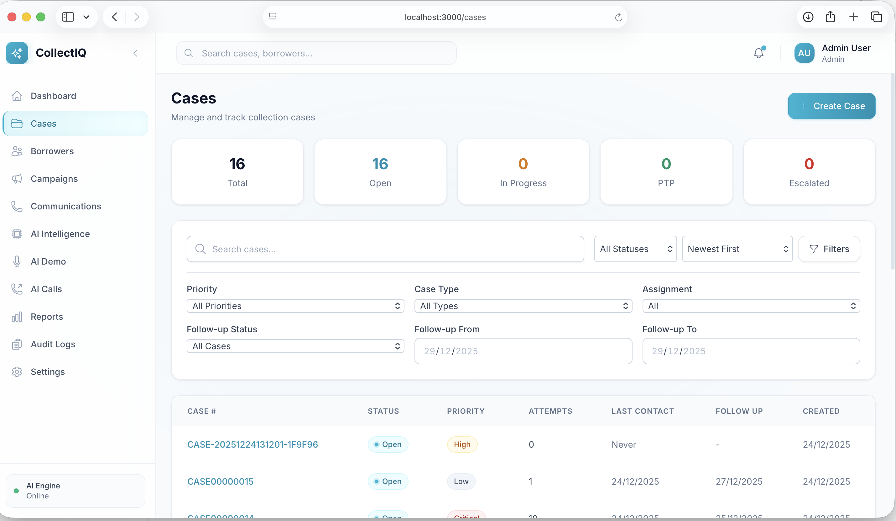

### Case Details

Click any case to see:
- Borrower info and contact details
- Loan details (amount, EMI, DPD)
- Communication history
- Payment promises and follow-ups

### Update Case Status

1. Open case details
2. Click status dropdown
3. Select new status
4. Add notes if needed

## Borrowers

View and manage borrower information:

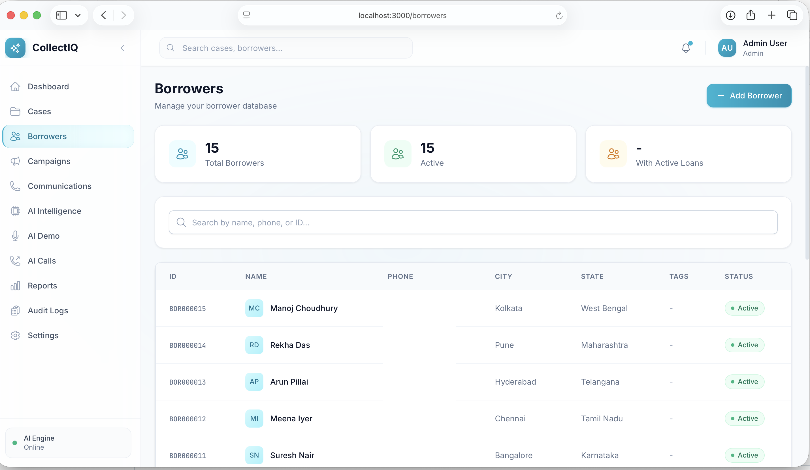

## Making Calls

### Manual Call (Click-to-Call)

1. Open a case
2. Click the phone icon next to borrower's number
3. Your phone will ring first, then connects to borrower

### AI Voice Call

1. Go to **AI Calls** page
2. Select a case or enter phone number
3. Review borrower context
4. Click **Make AI Call**
5. AI agent handles the conversation automatically

### Internal Voice Demo

Test AI voice conversations directly in the browser:

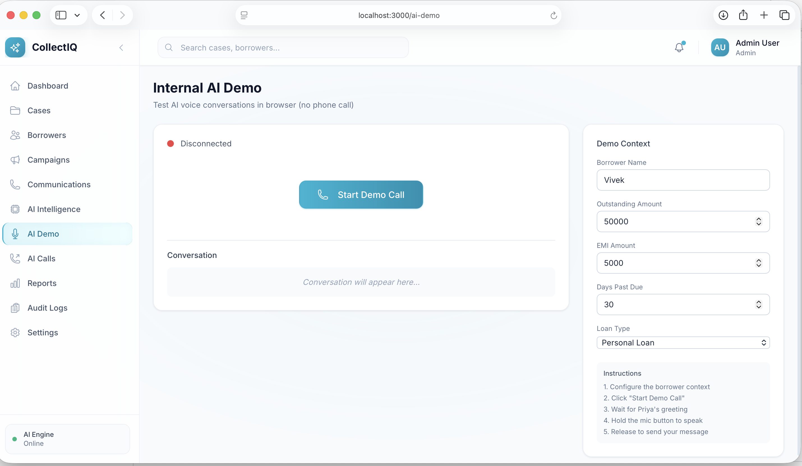

## Sending Messages

### SMS & WhatsApp Templates

Configure message templates:

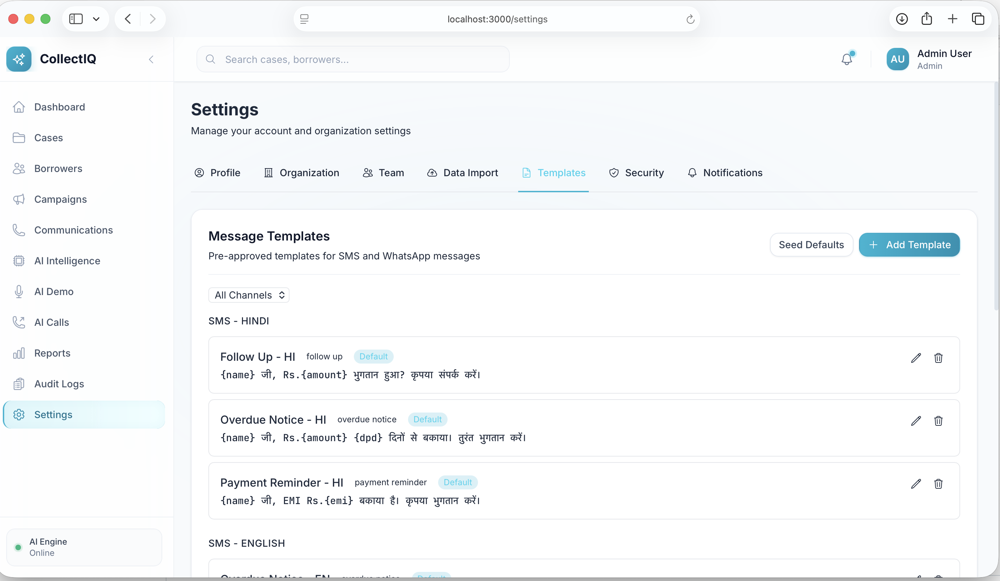

### SMS
1. Open case details
2. Click **Send SMS**
3. Select template or type custom message
4. Click Send

### WhatsApp
1. Open case details
2. Click **Send WhatsApp**
3. Select approved template
4. Click Send

## Communications

### View All Communications

Track all calls, SMS, and WhatsApp messages:

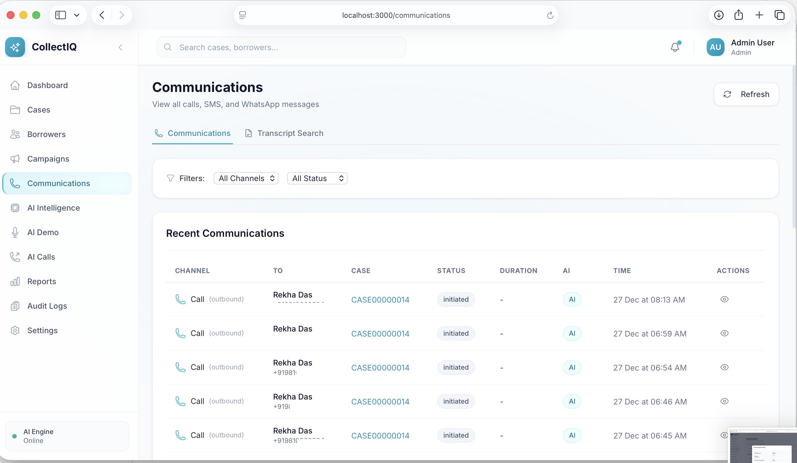

### Communication Details

Click any communication to see full details:

### Search Transcripts

Search through AI call transcripts:

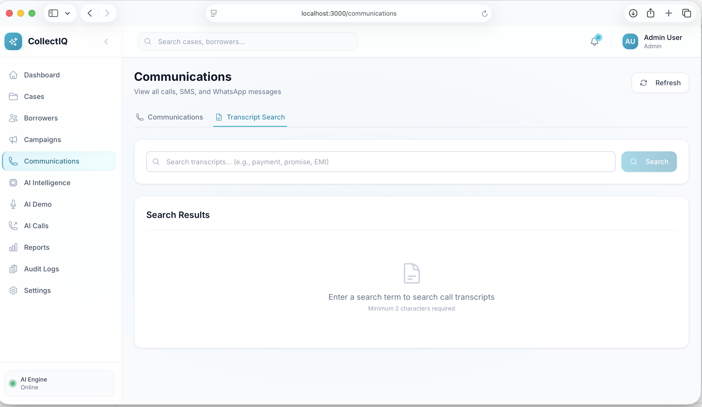

## Running Campaigns

### View Campaigns

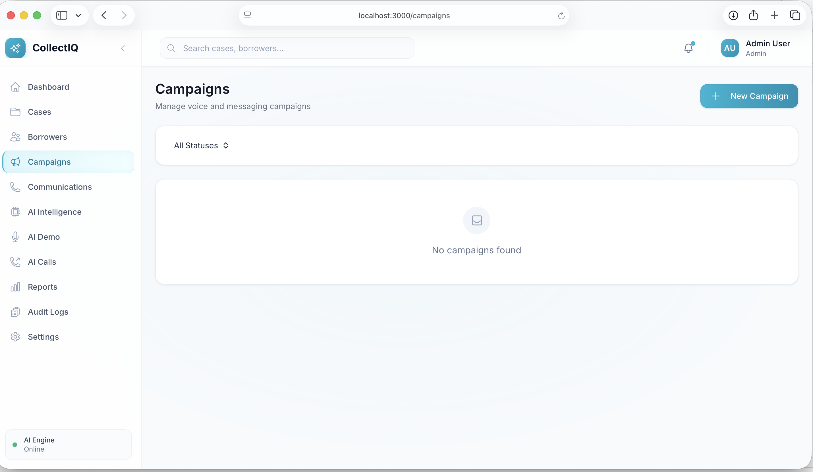

### Create Campaign

1. Go to **Campaigns**
2. Click **New Campaign**
3. Configure:
   - Name and type (AI Voice, SMS, WhatsApp)
   - Target cases (filter by DPD, amount, etc.)
   - Schedule and retry settings
4. Click Create

### Monitor Campaign

- View live progress on campaign detail page
- See calls in progress, success rates, outcomes
- Pause/resume as needed

## AI Intelligence

Use AI-powered insights for collection strategy:

### Features

- **Priority Scoring** - AI calculates case priority based on amount, DPD, risk
- **Risk Assessment** - Identifies high-risk cases
- **Collection Strategy** - Recommends approach based on DPD bucket

### Create Campaigns from AI Strategy

Quickly create targeted campaigns based on AI recommendations:

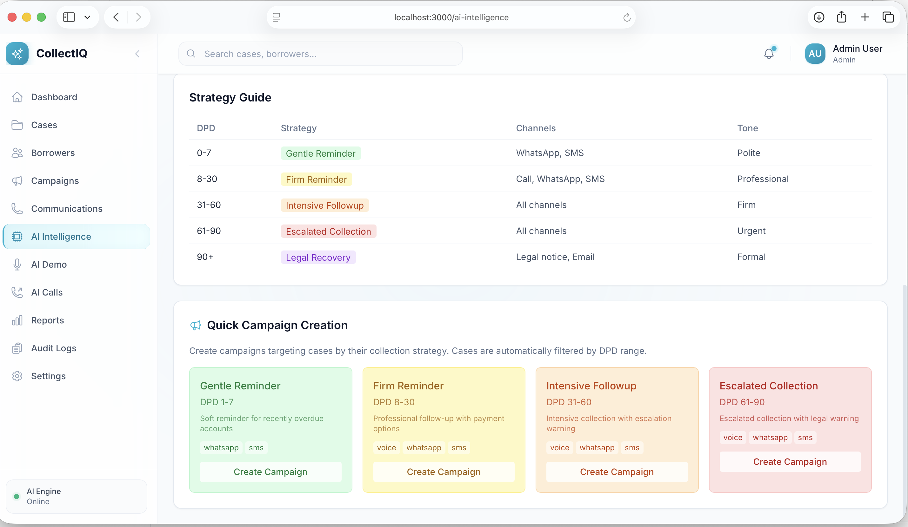

## Reports

View collection analytics and performance metrics:

## Admin Features

### Audit Logs

Track all system activities and changes:

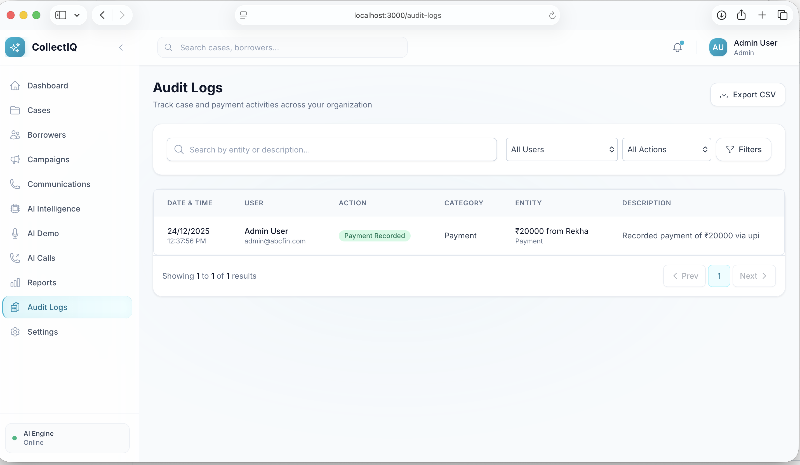

### Settings - Profile

Update your profile and preferences:

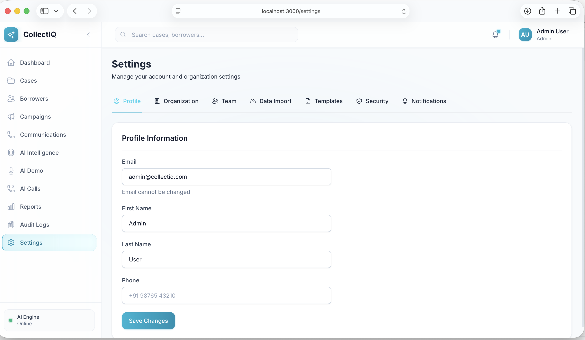

### Team Management

Manage users and roles (Admin only):

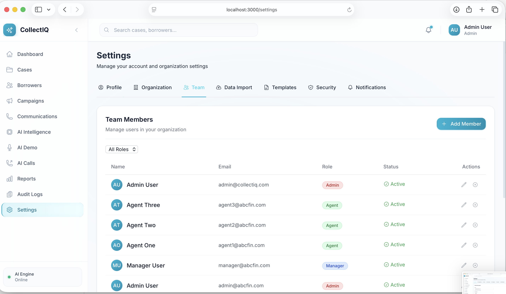

### Data Import

Bulk import data via **Settings > Data Import** (Admin only):

| Import Type | Purpose |
|-------------|---------|
| Import Cases | New borrowers + loans + cases |
| Import Borrowers | Add customer contacts |
| Update Loans | Daily portfolio updates (amounts, DPD) |

1. Download CSV template
2. Fill in data
3. Upload and review results

## Key Shortcuts

| Action | How |
|--------|-----|
| Search | `Ctrl/Cmd + K` |
| New Case | Cases page → Create Case |
| Quick Call | Click phone icon on any case |

## Tips

- **Follow-ups**: Set follow-up dates to track promises
- **Notes**: Add notes after every call for history
- **Tags**: Use tags to categorize borrowers
- **Filters**: Save common filters for quick access

## Need Help?

- Check case history for past communications
- Review AI call transcripts for conversation details
- Contact your admin for access issues
